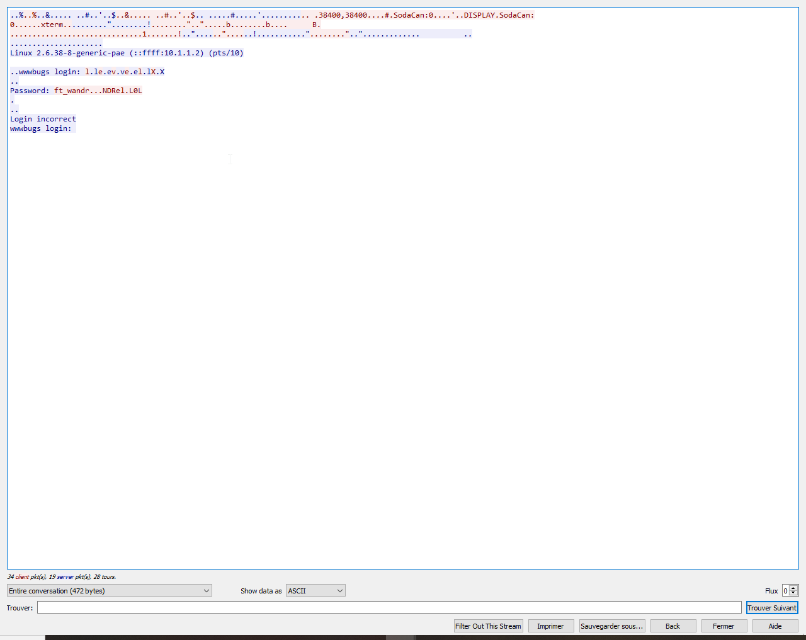

Télécharger le fichier pcap:

`scp -P 4242 level02@192.168.1.xx:level02.pcap .`

Ensuite il faut l'ouvrir dans Wireshark, sélectionner le premier packet et utliser l'option 'Follow TCP Stream' dans le menu Analyze.
Ce qui donne: 

Pour reconstituer le mot de passe, il faut retirer une lettre à chaque fois que l'on rencontre un '.'.

Résultat: ft_waNDReL0L

