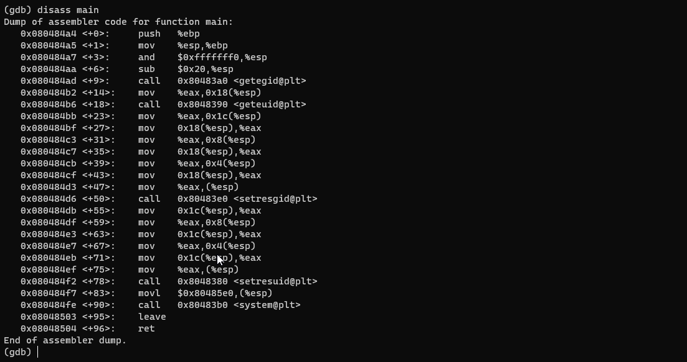
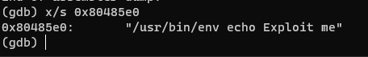
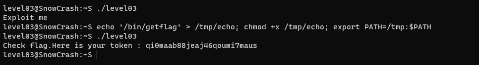

En ouvrant le programme *level03* avec GDB, on peut analyser son fonctionnement:

On peut donc voir que le programme fait un appel à la fonction **system**, permettant d'exécuter une commande avec /bin/sh.

Pour voir la commande que le programme exécute avec system, on utilise la command `x/s` avec l'adresse mémoire de l'instruction précedant l'appel à system:

`x/s 0x80485e0`

Maintenant que l'on connait la commande que le programme exécute, il suffit de créer un faux echo et faire en sorte qu'il soit éxécuter à la place du vrai echo:

`echo '/bin/getflag' > /tmp/echo; chmod +x /tmp/echo; export PATH=/tmp:$PATH`

Source: https://failingsilently.wordpress.com/2017/09/08/exploiting-calls-to-system/
