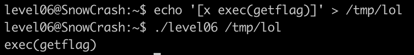
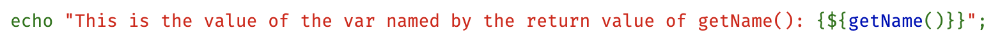
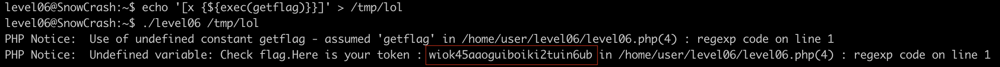

Nous avons deux fichiers: un script php et son binaire.

En regardant le script on remarque qu'il prend deux arguments mais que seulement le premier est utilisé. 

La première fonction utilise file_get_contents($y) on en déduit donc que cet argument doit être un fichier.

On découvre la syntaxe [x ...] ainsi que le modifier e qui permet de d'executer la string donnée en paramètre.

On essaye donc d'executer getflag en l'appelant dans le fichier du premier argument:

En cherchant un peu dans les man on trouve une syntaxe qui permet d'executer correctement notre commande:
https://www.php.net/manual/fr/language.types.string.php#language.types.string.parsing.complex

