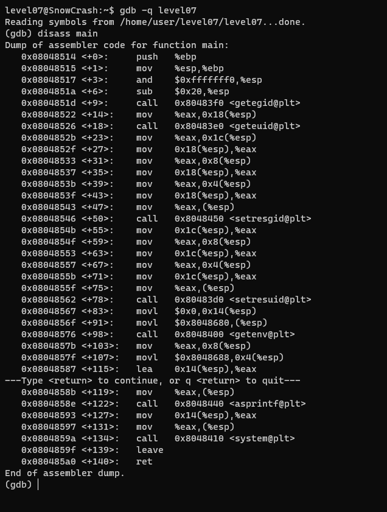
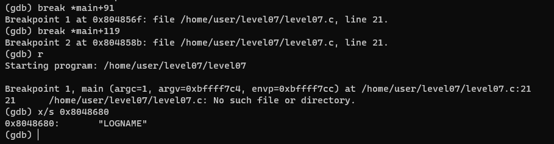
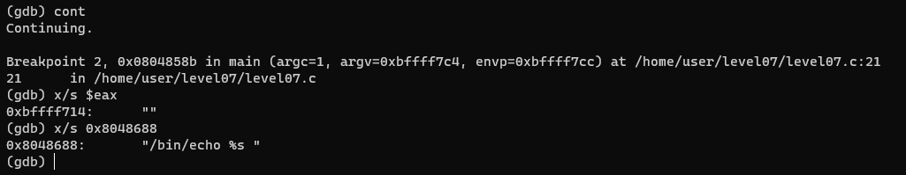

Dans le home de level07 se trouve un executable nommé level07 appartenant à flag07.
Ce qui rappelle fortement le level03, on va donc appliquer la même logique.

1. Trouver une faille avec GDB:

Globalement, le programme à la même structure:
- Appels aux fonctions getegid, geteuid, setresgid et setresuid
- Un appel à la fonction system que l'on va exploiter

En plus, on remarque un appel à `getenv` et un appel à `asprintf`.

L'appel à `getenv` récupère la variable *LOGNAME*:

L'appel à `asprintf` prend comme format ceci:

2. L'exploiter

Ce programme récupère donc la variable **LOGNAME** de l'environnement avant de l'afficher en appelant `/bin/echo` via la fonction `system`.

Pour récupérer le flag il suffit de modifier la variable LOGNAME pour faire exécuter `getflag` par sh:

`LOGNAME='$(getflag)'`