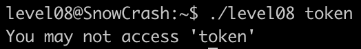
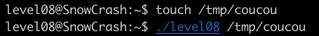
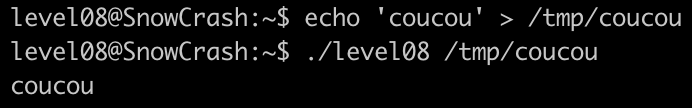
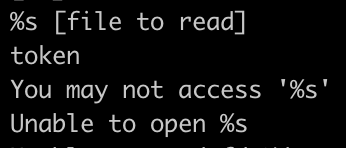
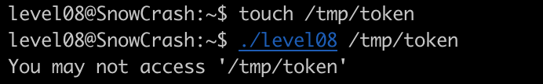
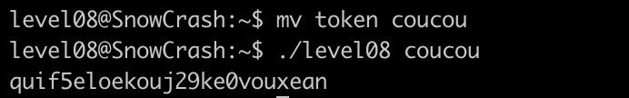

On a encore deux fichiers: un binaire et un fichier token pour lequel nous n'avons aucune permission.

On essaye de donner token en paramètre:

On ne peut pas y accéder, on essaye donc de lui donner un fichier vide:

Ça fonctionne mais rien ne se passe, on essaye ensuite de donner un fichier rempli:

Le script retourne le contenu du fichier.

En lançant la commande strings sur level08 on trouve:

On imagine que le binaire renvoie `You may not access '%s'` quand le fichier a pour nom token. Pour prouver ça on créé un nouveau fichier token:

Pour accéder au contenu il faudrait donc changer le nom de token.
En faisant `chmod 777 .` on peut se donner tous les droits dans le répertoire courant et donc changer le nom de token:

On peut utiliser ce mot de passe pour accéder à l'utilisateur flag08 et trouver le flag.