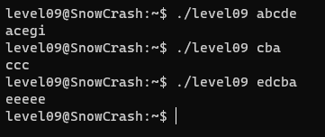
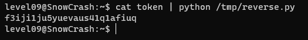

Dans le home du level09 se trouve un executable et un fichier token.

En utilisant cat sur le fichier token on remarque un texte qu'on ne peut pas lire complètement, il doit sûrement être encodé.

L'executable prend un texte en argument, le traite et affiche un résultat.

J'ai d'abord essayé de l'analyser avec GDB et strings avant de remarqué un message:

`You should not reverse this`

Donc je me suis arrêté la avec GDB, en plus il n'y a pas d'appel à system cette fois-ci.

En testant plusieurs valeurs, j'ai remarqué que le programme renvoyait la même chaine de caractère mais avait ajouter à chaque charactères la valeur de sa place dans la chaine:



Pour inverser ces changements, il suffit donc de soustraire, c'est ce que fait ce script en python:

```
import sys

text = file.read(sys.stdin)
result = ''

for i, c in enumerate(text):
	result += chr(abs(ord(c) - i))

print result
```

Résultat:


