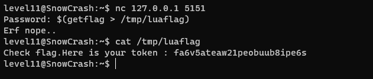

Dans le home du level11, on trouve un fichier lua contenant le code d'un serveur qui tourne sur la machine.

En regardant le code, on peut voir qu'il utilise cette ligne pour hasher le mot de passe envoyer par l'utilisateur:

`prog = io.popen("echo "..pass.." | sha1sum", "r")`

La fonction io.popen permet d'executer une commande avec sh ce qui est fort intéressant pour nous car le fichier level11.lua appartient à flag11.

On peut donc récupérer le flag en envoyant ce mot de passe:

`$(getflag > /tmp/luaflag)`

Article sur les vulnérabilités du Lua pour les applications web: https://www.syhunt.com/en/index.php?n=Articles.LuaVulnerabilities