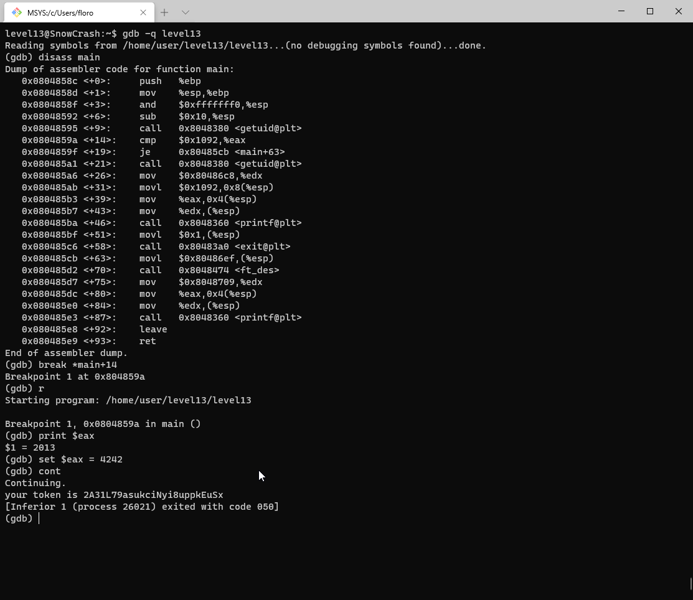

Pour le level13, un executable du meme nom est présent dans le home.

En l'executant, on apprend que le programme attend d'être lancé par l'utilisateur avec l'id 4242.

Pour cela, on va donc modifier la valeur de la variable avec GDB juste avant la comparaison afin d'accéder à la suite du programme:

On a donc défini un breakpoint pour s'arreter avant la comparaison (opérateur `cmp`) pour pouvoir modifier la variable.

On peut voir sur la ligne suivante que le programme saute jusque `main+63` si le cmp est vrai.

Juste avant `main+63` on peut voir un appel à `exit` donc si cmp est faut, il affiche le message d'erreur est quitte le programme.