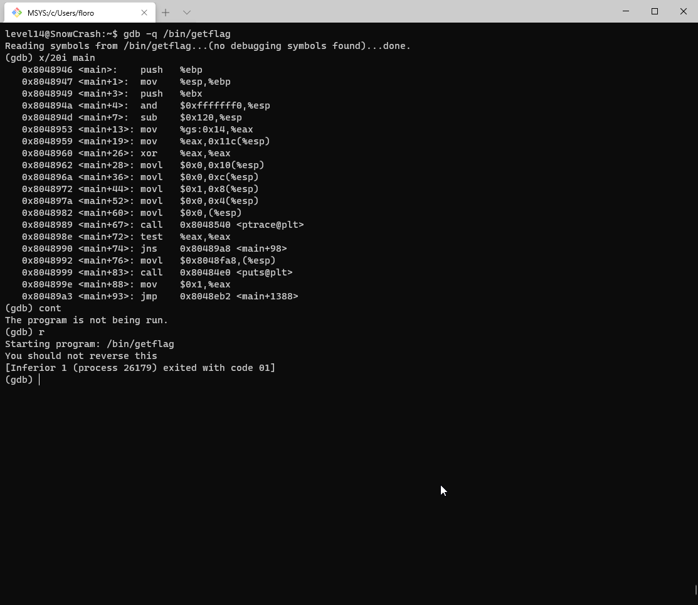

Pour le level14, aucun fichier n'est donné dans le home et aucun fichier n'appartient à flag14 ou level14 sur le système.

Cependant, nous avons appris avec le level13 qu'il est possible de remplacer une valeur avec GDB et ainsi de changer pendant l'execution la valeur de retour de la fonction `getuid`.

Donc rien ne nous empêche de le faire sur `getflag` tant que gdb fonctionne avec.

Problème:



`getflag` nous empêche de le lancer dans GDB et quitte immédiatement.

On peut toutefois noter l'utilisation de ptrace juste avant un appel à `test` qui s'il renvoi vraie jump à `main+98`.
Si le test est faux, getflag appelle `puts` puis saute ) `main+1388` qui est la fin du programme.

On doit donc pouvoir comme pour `getuid`, modifier la valeur de retour juste avant le test:

```
[.......]
  0x08048aae <+360>:   cmpl   $0x0,0x10(%esp)
   0x08048ab3 <+365>:   je     0x8048e89 <main+1347>
   0x08048ab9 <+371>:   movl   $0x8049068,0x4(%esp)
   0x08048ac1 <+379>:   lea    0x1c(%esp),%eax
   0x08048ac5 <+383>:   mov    %eax,(%esp)
   0x08048ac8 <+386>:   call   0x8048843 <isLib>
   0x08048acd <+391>:   test   %eax,%eax
   0x08048acf <+393>:   je     0x8048e46 <main+1280>
   0x08048ad5 <+399>:   mov    0x804b060,%eax
   0x08048ada <+404>:   mov    %eax,%edx
   0x08048adc <+406>:   mov    $0x804906c,%eax
   0x08048ae1 <+411>:   mov    %edx,0xc(%esp)
   0x08048ae5 <+415>:   movl   $0x20,0x8(%esp)
   0x08048aed <+423>:   movl   $0x1,0x4(%esp)
   0x08048af5 <+431>:   mov    %eax,(%esp)
   0x08048af8 <+434>:   call   0x80484c0 <fwrite@plt>
   0x08048afd <+439>:   call   0x80484b0 <getuid@plt>
   0x08048b02 <+444>:   mov    %eax,0x18(%esp)
   0x08048b06 <+448>:   mov    0x18(%esp),%eax
   0x08048b0a <+452>:   cmp    $0xbbe,%eax
---Type <return> to continue, or q <return> to quit---
   0x08048b0f <+457>:   je     0x8048ccb <main+901>
[...........]
(gdb) break *main+444
Breakpoint 1 at 0x8048b02
(gdb) r
Starting program: /bin/getflag
You should not reverse this
[Inferior 1 (process 26242) exited with code 01]
(gdb) break *main+72
Breakpoint 2 at 0x804898e
(gdb) r
Starting program: /bin/getflag

Breakpoint 2, 0x0804898e in main ()
(gdb) p $eax
$1 = -1
(gdb) set $eax = 0
(gdb) cont
Continuing.

Breakpoint 1, 0x08048b02 in main ()
(gdb) print $eax
$2 = 2014
(gdb) set $eax = 3014
(gdb) cont
Continuing.
Check flag.Here is your token : 7QiHafiNa3HVozsaXkawuYrTstxbpABHD8CPnHJ
[Inferior 1 (process 26251) exited normally]
```